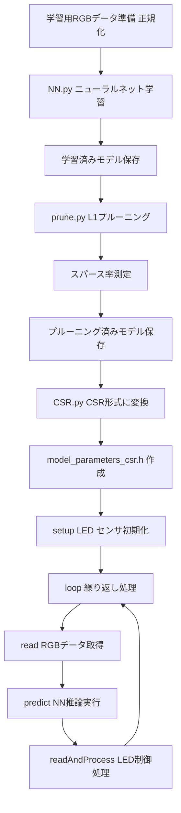

# report

```mermaid
flowchart TD

    A[学習用RGBデータ準備 正規化] --> B[NN.py ニューラルネット学習]
    B --> C[学習済みモデル保存]
    C --> D[prune.py L1プルーニング]
    D --> E[スパース率測定]
    E --> F[プルーニング済みモデル保存]
    F --> G[CSR.py CSR形式に変換]
    G --> H[model_parameters_csr.h 作成]

    H --> J[setup LED センサ初期化]
    J --> K[loop 繰り返し処理]

    K --> L[read RGBデータ取得]
    L --> M[predict NN推論実行]
    M --> N[readAndProcess LED制御処理]
    N --> K

```