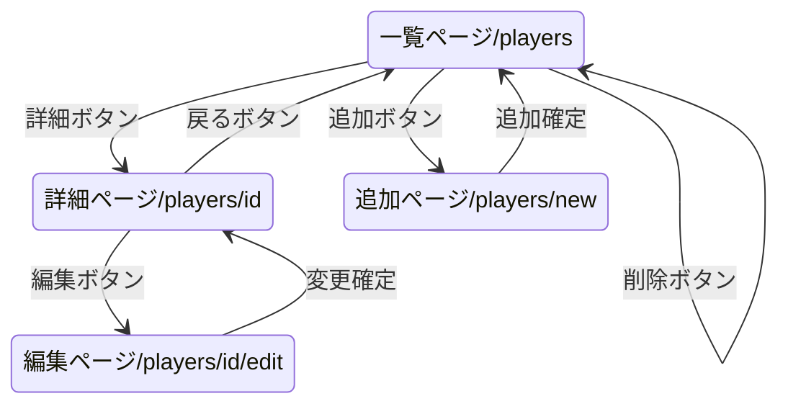

#　開発者向け仕様書

##　概要
野球選手一覧，世界都市システム，やることリストの３つをnode.jsを用いて作成する．

### 野球球団選手一覧システム
野球選手一覧を作成する．
rep.jsに

```mermaid
stateDiagram-v2

    一覧ページ/players --> 詳細ページ/players/id :詳細ボタン
    一覧ページ/players --> 一覧ページ/players:削除ボタン
    一覧ページ/players --> 追加ページ/players/new :追加ボタン

    詳細ページ/players/id --> 編集ページ/players/id/edit :編集ボタン
    編集ページ/players/id/edit -->詳細ページ/players/id:変更確定
    詳細ページ/players/id --> 一覧ページ/players:戻るボタン
    追加ページ/players/new --> 一覧ページ/players:追加確定

```

### 世界都市システム

### やることリスト
